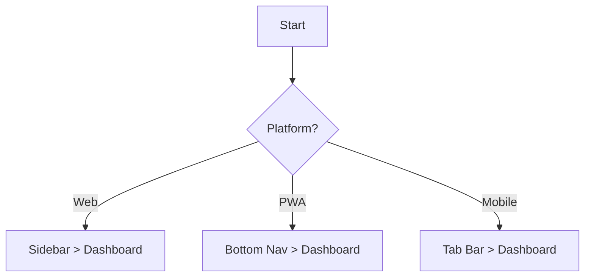
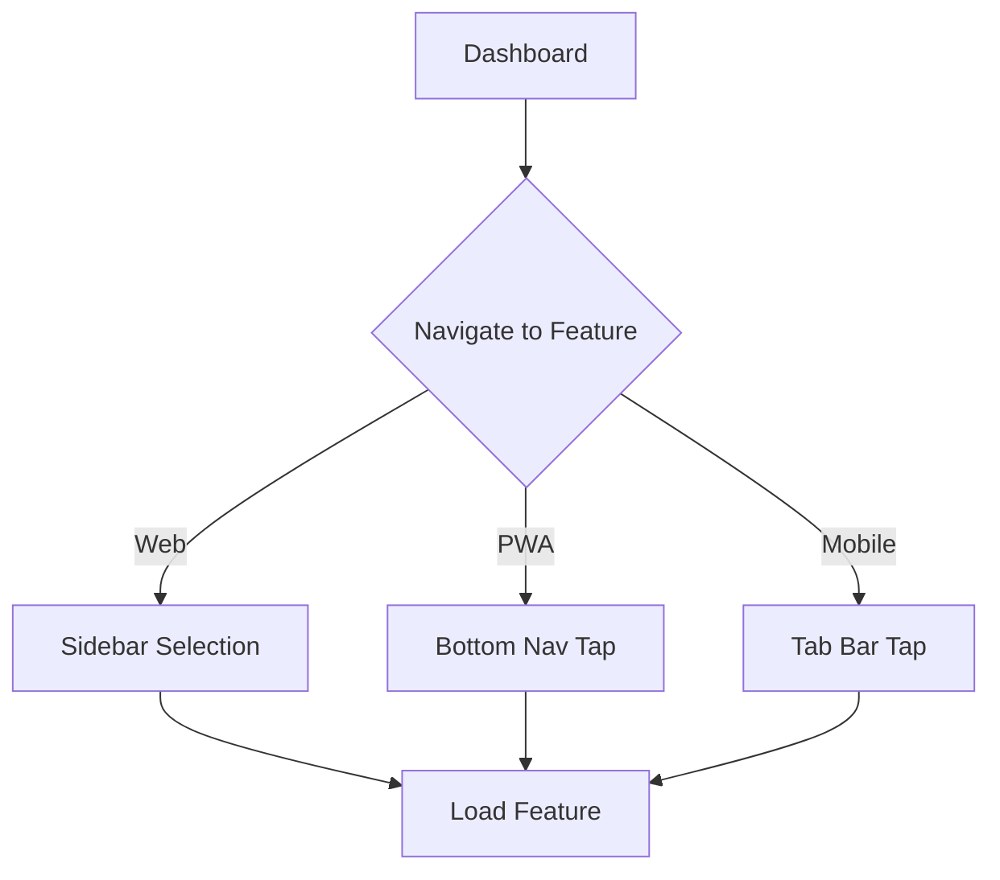

# Navigation Patterns

## Overview
This document outlines the navigation patterns and user flows across different platforms in Well-Charged.

## Core Navigation Principles

### 1. Consistency First
- Maintain consistent navigation patterns within each platform
- Keep core features accessible in similar ways across platforms
- Use platform-native patterns where they exist

### 2. Platform-Specific Patterns

#### Web Browser
```typescript
// Primary Navigation
- Top header with dropdown menus
- Left sidebar for main navigation
- Breadcrumbs for hierarchy
- Browser back/forward support

// Secondary Navigation
- Tabs for related content
- Dropdown menus for actions
- Modal dialogs for focused tasks
```

#### Web App (PWA)
```typescript
// Primary Navigation
- Collapsible sidebar
- Bottom navigation bar
- Swipe gestures
- App-like header

// Secondary Navigation
- Slide-up panels
- Action sheets
- Full-screen modals
```

#### Mobile App
```typescript
// Primary Navigation
- Bottom tab bar
- Native navigation stack
- Swipe gestures
- Hardware back button

// Secondary Navigation
- Native modals
- Action sheets
- Pull-to-refresh
```

## User Flows

### 1. Dashboard Access


### 2. Feature Navigation


### 3. Deep Linking
```typescript
// URL Structure
web: /feature/subfeature
pwa: /feature/subfeature
mobile: myapp://feature/subfeature

// Handling
if (isPlatformMobile) {
  handleNativeDeepLink(url);
} else {
  handleWebDeepLink(url);
}
```

## Implementation Guidelines

### 1. Router Configuration
```typescript
// Base Router Config
const baseRoutes = [
  {
    path: '/',
    component: Platform.select({
      web: WebLayout,
      pwa: PWALayout,
      mobile: MobileLayout,
    }),
    children: [
      // Shared routes
    ],
  },
];

// Platform-Specific Routes
const platformRoutes = Platform.select({
  web: webOnlyRoutes,
  pwa: pwaRoutes,
  mobile: mobileRoutes,
});
```

### 2. Navigation Guards
```typescript
// Platform Check Guard
const platformGuard = (to, from, next) => {
  if (!isPlatformSupported(to.meta.platforms)) {
    next({ name: 'fallback' });
    return;
  }
  next();
};

// Feature Support Guard
const featureGuard = (to, from, next) => {
  if (!isFeatureSupported(to.meta.feature)) {
    next({ name: 'unsupported' });
    return;
  }
  next();
};
```

### 3. Navigation State Management
```typescript
// Navigation Store
interface NavigationState {
  currentPlatform: Platform;
  history: Route[];
  canGoBack: boolean;
}

// Navigation Actions
const navigationActions = {
  goBack: () => Platform.select({
    web: () => window.history.back(),
    pwa: () => navigator.goBack(),
    mobile: () => NativeNavigation.pop(),
  }),
  
  navigate: (route: string) => Platform.select({
    web: () => router.push(route),
    pwa: () => navigator.push(route),
    mobile: () => NativeNavigation.push(route),
  }),
};
```

## Platform-Specific Considerations

### Web Browser
- Support keyboard navigation
- Handle browser history
- Support multiple tabs
- Consider bookmark behavior

### Web App (PWA)
- Implement app-like navigation
- Handle offline state
- Support screen transitions
- Consider home screen launch

### Mobile App
- Use native navigation patterns
- Handle deep linking
- Support gesture navigation
- Consider app lifecycle

## Testing Strategy

### Unit Tests
```typescript
describe('Navigation', () => {
  it('should use correct layout per platform', () => {
    const platform = getPlatform();
    const layout = getLayoutComponent();
    expect(layout).toBe(platformLayouts[platform]);
  });
});
```

### Integration Tests
```typescript
describe('Navigation Flows', () => {
  it('should handle deep links correctly', () => {
    const deepLink = 'myapp://feature/123';
    const result = handleDeepLink(deepLink);
    expect(result.route).toBe('/feature/123');
  });
});
```

## Troubleshooting Guide

### Common Issues

1. Back Navigation
```typescript
// Issue: Inconsistent back behavior
// Solution:
const handleBack = () => {
  if (canGoBack()) {
    navigationActions.goBack();
  } else {
    navigateToHome();
  }
};
```

2. Deep Linking
```typescript
// Issue: Deep link not working
// Solution:
const handleDeepLink = (url: string) => {
  const route = parseDeepLink(url);
  if (isValidRoute(route)) {
    navigate(route);
  } else {
    handleInvalidRoute(route);
  }
};
```

3. Platform Detection
```typescript
// Issue: Wrong platform detection
// Solution:
const detectPlatform = () => {
  const userAgent = navigator.userAgent;
  const standalone = window.matchMedia('(display-mode: standalone)').matches;
  return determineCorrectPlatform(userAgent, standalone);
};
```

## Best Practices

1. Always test navigation flows on all platforms
2. Use platform-specific animations
3. Handle edge cases (offline, errors)
4. Maintain consistent back stack
5. Document platform differences

## Monitoring and Analytics

### Key Metrics
- Navigation success rate
- Time to navigate
- Error rates
- User flow completion

### Implementation
```typescript
const trackNavigation = (from: string, to: string) => {
  analytics.track('navigation', {
    from,
    to,
    platform: getPlatform(),
    timestamp: Date.now(),
  });
};
```
