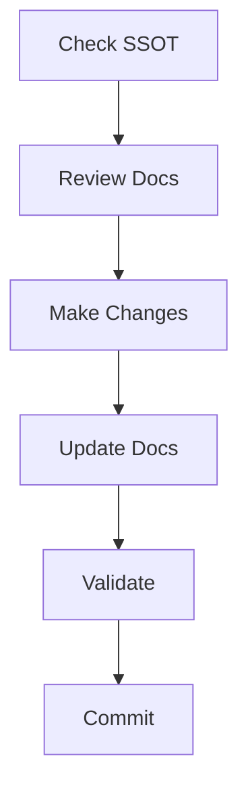

# SSOT (Single Source of Truth) System Adoption Guide

## Overview
This guide outlines how to implement a comprehensive and strict SSOT documentation system in your workspace. This system ensures documentation consistency, reduces errors, and maintains a single source of truth for all project aspects.

## Core SSOT Structure

### 1. Directory Structure
```
docs/
└── ssot/
    ├── SSOT_GUIDELINES.md       # Master guidelines
    ├── DOCUMENTATION_STRUCTURE.md
    ├── platform/
    │   ├── PLATFORM_FEATURES.md # Feature matrix
    │   ├── PLATFORM_STRATEGY.md # Implementation strategy
    │   └── ROUTING_STRATEGY.md  # Routing conventions
    ├── technical/
    │   ├── API.md              # API documentation
    │   ├── SECURITY.md         # Security protocols
    │   └── EDGE_FUNCTIONS.md   # Edge functionality
    └── development/
        ├── STYLE_GUIDE.md      # Coding standards
        └── DEVELOPMENT_STATUS.md # Progress tracking
```

### 2. Workspace Rules Enhancement
Add to your `.windsurfrules`:

```yaml
documentation:
  ssot:
    root_directory: docs/ssot/
    guidelines_file: docs/ssot/SSOT_GUIDELINES.md
    pre_edit_requirements:
      - check_guidelines: true
      - review_affected_files: true
      - verify_platform_compatibility: true
    post_edit_requirements:
      - update_affected_files: true
      - verify_cross_references: true
      - update_changelogs: true
    validation:
      enforce_rules: true
      block_on_violation: true
      check_formatting: true
    files:
      platform:
        - path: docs/ssot/platform/PLATFORM_FEATURES.md
          purpose: Feature availability matrix
          update_triggers:
            - new_feature
            - platform_change
        - path: docs/ssot/platform/PLATFORM_STRATEGY.md
          purpose: Implementation strategies
          update_triggers:
            - architecture_change
            - tech_stack_update
      technical:
        - path: docs/ssot/technical/API.md
          purpose: API documentation
          update_triggers:
            - endpoint_change
            - parameter_update
      development:
        - path: docs/ssot/development/STYLE_GUIDE.md
          purpose: Coding standards
          update_triggers:
            - standard_update
            - tool_change
```

## Implementation Steps

### 1. Initial Setup
1. Create SSOT directory structure
2. Add SSOT rules to workspace configuration
3. Create initial documentation templates
4. Set up validation hooks

### 2. Documentation Requirements
Each SSOT file must have:
- Clear purpose statement
- Update triggers
- Required sections
- Validation rules
- Cross-reference guidelines

### 3. Pre-Edit Workflow
Before any code changes:
1. Check SSOT guidelines
2. Review affected documentation
3. Verify platform compatibility
4. Ensure cross-reference integrity

### 4. Post-Edit Requirements
After code changes:
1. Update affected SSOT files
2. Verify cross-references
3. Update changelogs
4. Run validation checks

## Validation System

### 1. Documentation Checks
- Format compliance
- Cross-reference integrity
- Section completeness
- Update trigger validation

### 2. Code Compliance
- Platform compatibility
- Feature documentation
- API documentation
- Security requirements

### 3. Change Management
- Pre-change documentation review
- Post-change documentation updates
- Changelog maintenance
- Cross-reference updates

## Best Practices

### 1. Documentation Standards
- Use consistent formatting
- Maintain clear section hierarchy
- Include practical examples
- Keep cross-references updated

### 2. Update Triggers
Document updates required when:
- Adding new features
- Changing platforms
- Updating architecture
- Modifying security

### 3. Cross-Referencing
- Use relative links
- Maintain bidirectional references
- Verify reference integrity
- Update affected documents

### 4. Validation Rules
- Enforce formatting standards
- Check section completeness
- Verify cross-references
- Maintain changelog accuracy

## Integration Guidelines

### 1. Development Workflow


### 2. Code Review Process
- Verify SSOT compliance
- Check documentation updates
- Validate cross-references
- Confirm changelog entries

### 3. CI/CD Integration
- Add documentation checks
- Validate cross-references
- Verify format compliance
- Check update triggers

## Maintenance

### 1. Regular Reviews
- Monthly documentation audit
- Cross-reference verification
- Update trigger review
- Format compliance check

### 2. Updates
- Keep guidelines current
- Update templates
- Refresh examples
- Maintain validation rules

### 3. Version Control
- Track documentation versions
- Maintain change history
- Link to code versions
- Record update triggers

## Benefits

1. **Error Reduction**
   - Single source of truth
   - Clear update triggers
   - Validation enforcement
   - Cross-reference integrity

2. **Maintainability**
   - Consistent structure
   - Clear guidelines
   - Easy updates
   - Automated validation

3. **Development Efficiency**
   - Clear requirements
   - Easy reference
   - Reduced confusion
   - Quick onboarding

4. **Quality Assurance**
   - Documentation accuracy
   - Code compliance
   - Feature tracking
   - Security maintenance

## Implementation Checklist

### Initial Setup
- [ ] Create SSOT directory structure
- [ ] Add workspace rules
- [ ] Create initial templates
- [ ] Set up validation

### Documentation
- [ ] Write guidelines
- [ ] Create templates
- [ ] Define update triggers
- [ ] Establish cross-references

### Validation
- [ ] Implement checks
- [ ] Set up automation
- [ ] Define error handling
- [ ] Create reports

### Training
- [ ] Developer documentation
- [ ] Review process
- [ ] Update procedures
- [ ] Validation requirements
